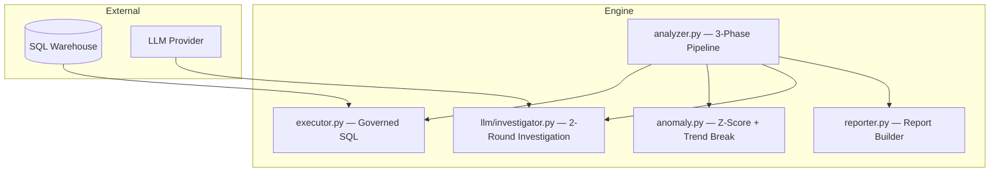

# Insight Engine — Technical Architecture

## System Overview

## Pipeline Phases

| Phase | What | How |
|-------|------|-----|
| 1. Pre-Fetch | Parallel KPI data collection | ThreadPoolExecutor (6 workers, 30s timeout) |
| 2. Investigation | 2-round LLM root cause analysis | JSON array queries, max 6/round |
| 3. Report | Hybrid deterministic + narrative | Python tables + LLM interpretation |

## SQL Governance (6 Layers)

1. **Auto-Fix** — Correct known LLM column misnames
2. **Auto-Qualify** — Add schema prefix to bare tables
3. **DDL/DML Block** — Only SELECT allowed
4. **Allowlist** — Only permitted tables
5. **PII Block** — Blocked columns rejected
6. **Auto-LIMIT** — Inject LIMIT 500 if missing

## Key Design Decisions

| Decision | Rationale |
|---|---|
| Python builds tables, LLM writes narrative | Deterministic math + contextual reasoning |
| 2-round investigation (not unbounded) | Prevents runaway token costs |
| JSON array response format | Reliable parsing |
| JSONL log (not database) | Simple, append-only, no dependencies |
| Fallback mode without LLM | Core value works without API keys |
